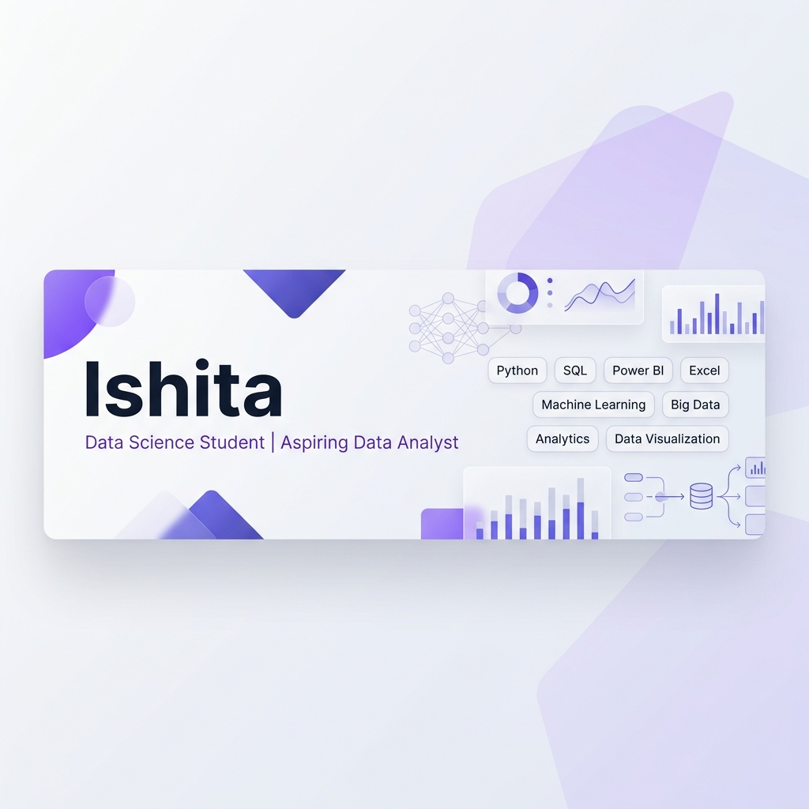

<!-- Header Banner -->

 

<!-- Animated Typing SVG -->

<h1 align="center">Hi, I'm Ishita 👋</h1>

  <b>Computer Science Student Specializing in Data Science</b> 
  Building practical data analytics, visualization, and database projects

<!-- Profile Views Badge -->

  

---

### 📌 About Me

I am a Computer Science & Engineering student specializing in Data Science at Lovely Professional University. My goal is to build a strong foundation in data analytics, learning how to clean, analyze, and visualize complex datasets to support data-driven decision-making.

Through my academic coursework and hands-on practice, I work regularly with Python, SQL, Power BI, and Excel. I enjoy analyzing data methodically—discovering patterns, solving data problems, and presenting actionable insights through intuitive dashboards.

I'm actively building practical projects while strengthening my analytical skills in preparation for Data Analyst internship opportunities.

---

### ⚡ Quick Snapshot

<table width="100%">
  <tr>
    <td width="50%" valign="top">
      <b>🎓 Education:</b> B.Tech CSE (Data Science Specialization) 
      <b>📍 Institution:</b> Lovely Professional University 
      <b>💼 Current Role:</b> Data Science Student 
      <b>🎯 Career Goal:</b> Secure a Data Analyst / Data Science Internship
    </td>
    <td width="50%" valign="top">
      <b>📊 Core Interests:</b> Data Analytics, Business Intelligence, Data Visualization, Big Data 
      <b>🌱 Active Learning:</b> Hadoop Ecosystem, Advanced SQL, Python for Data Analysis
    </td>
  </tr>
</table>

---

### 🔍 Current Focus

- 🎯 **Skill Enhancement:** Strengthening SQL query writing (joins, subqueries, aggregations) and data manipulation using Python libraries like Pandas and NumPy.
- 📊 **Dashboard Design:** Building clear, interactive Power BI and Excel dashboards with meaningful metrics and structured layouts.
- 🐘 **Big Data Foundations:** Exploring distributed storage and query processing fundamentals using Hadoop HDFS, Hive, and HBase.

---

### 🚧 Currently Working On

- 🤖 **Chippo OS:** Developing an AI-powered business reality simulation concept to model business scenarios *(under active development)*.
- 📊 **Power BI Dashboards:** Creating interactive visual reports for transactional datasets and sales performance metrics.
- 🐍 **Python Data Analytics:** Writing modular scripts for dataset cleaning, exploratory analysis, and data wrangling.
- 🧠 **Advanced SQL Practice:** Solving database querying exercises focusing on complex joins and window functions.

---

### 🛠️ Tech Stack

<table width="100%">
  <tr>
    <td width="22%"><b>Programming</b></td>
    <td>
      
      &nbsp;
      
    </td>
  </tr>
  <tr>
    <td><b>Data Analysis</b></td>
    <td>
      
      
      
    </td>
  </tr>
  <tr>
    <td><b>Visualization</b></td>
    <td>
      
      
      
      
    </td>
  </tr>
  <tr>
    <td><b>Databases</b></td>
    <td>
      
    </td>
  </tr>
  <tr>
    <td><b>Big Data</b></td>
    <td>
      
      
      
    </td>
  </tr>
  <tr>
    <td><b>Tools</b></td>
    <td>
      
      &nbsp;
      
    </td>
  </tr>
</table>

---

### 📚 Learning & Proficiency Status

<table width="100%">
  <thead>
    <tr>
      <th align="left">Technology</th>
      <th align="left">Status / Level</th>
      <th align="left">Focus Area</th>
    </tr>
  </thead>
  <tbody>
    <tr>
      <td><b>Python for Data Analysis</b></td>
      <td><code>Intermediate</code></td>
      <td>Data cleaning, Pandas wrangling, exploratory analysis</td>
    </tr>
    <tr>
      <td><b>SQL</b></td>
      <td><code>Intermediate</code></td>
      <td>Relational database querying, joins, aggregations</td>
    </tr>
    <tr>
      <td><b>Power BI & Excel</b></td>
      <td><code>Intermediate</code></td>
      <td>Interactive report design, DAX measures, KPI tracking</td>
    </tr>
    <tr>
      <td><b>Hadoop Ecosystem</b></td>
      <td><code>Learning</code></td>
      <td>HDFS storage architecture, Hive querying, HBase basics</td>
    </tr>
    <tr>
      <td><b>Machine Learning</b></td>
      <td><code>Learning</code></td>
      <td>Fundamental classification & regression concepts</td>
    </tr>
  </tbody>
</table>

---

### 🚀 Featured Projects

<table width="100%">
  <tr>
    <td width="33%" height="240px" valign="top">
      <h4 align="center">🤖 Chippo OS</h4>
      
<i>(Under Active Development)</i>

      
An AI-powered business reality simulation project designed to model operational decision scenarios and explore business data workflows.

      
<b>Tech Stack</b> 
      <code>Python</code> • <code>AI Concept</code> • <code>Data Simulation</code>

      
<b>Highlights</b>

      <ul>
        <li>Business scenario simulation</li>
        <li>Analytical data flows</li>
        <li>Modular script structure</li>
      </ul>
    </td>
    <td width="33%" height="240px" valign="top">
      <h4 align="center">📊 Sales Performance Dashboard</h4>
      
Interactive sales analysis dashboard built to provide visual breakdowns of product performance, sales volumes, and regional metrics.

      
<b>Tech Stack</b> 
      <code>Power BI</code> • <code>Excel</code> • <code>Data Visualization</code>

      
<b>Highlights</b>

      <ul>
        <li>Transactional data cleaning</li>
        <li>KPI metric reporting</li>
        <li>Interactive visual layout</li>
      </ul>
    </td>
    <td width="33%" height="240px" valign="top">
      <h4 align="center">🧹 Data Cleaning & Pipeline Scripts</h4>
      
Modular Python utility scripts focused on dataset prep, handling missing values, duplicate removal, and automated CSV formatting.

      
<b>Tech Stack</b> 
      <code>Python</code> • <code>Pandas</code> • <code>Data Wrangling</code>

      
<b>Highlights</b>

      <ul>
        <li>CSV dataset standardization</li>
        <li>Missing value handling</li>
        <li>Reusable cleaning workflow</li>
      </ul>
    </td>
  </tr>
</table>

---

### 📊 GitHub Activity & Statistics

  <table border="0">
    <tr>
      <td valign="top">
        
      </td>
      <td valign="top">
        
      </td>
    </tr>
  </table>

 

  

 

<!-- Contribution Activity Graph -->

  

 

<!-- 
  GITHUB CONTRIBUTION SNAKE WORKFLOW:
  To generate the snake SVG animation automatically, create a workflow file at `.github/workflows/snake.yml` in your repository:

  name: Generate Contribution Snake
  on:
    schedule:
      - cron: "0 0 * * *"
    workflow_dispatch:
  jobs:
    build:
      runs-on: ubuntu-latest
      steps:
        - uses: Platane/snk@v3
          with:
            github_user_name: Ishita1306
            outputs: |
              dist/github-contribution-grid-snake.svg
              dist/github-contribution-grid-snake-dark.svg?palette=github-dark
        - uses: crazy-max/ghaction-github-pages@v3.1.0
          with:
            target_branch: output
            build_dir: dist
          env:
            GITHUB_TOKEN: ${{ secrets.GITHUB_TOKEN }}
-->

<!-- GitHub Contribution Snake Animation -->

  

---

### 🎯 2026 Goals

- [ ] 🎯 **Placement Goal**: Secure a Data Analyst or Data Science Internship.
- [ ] 💻 **Practical Projects**: Complete and document 5+ data analysis projects with clear documentation.
- [ ] 🧠 **SQL & Data Modeling**: Master advanced SQL joins, CTEs, window functions, and database schema design.
- [ ] 🌐 **Open Source**: Learn how to contribute to open-source data science tools and datasets.

---

### 💡 Fun Fact

I treat messy, unorganized datasets like high-stakes detective puzzles—finding the story hidden behind the numbers is the most satisfying part. In my free time, I enjoy reading novels!

---

### 💬 Favorite Quote

> *"Without data, you're just another person with an opinion."*  
> — **W. Edwards Deming**

---

  Turning Data into Insights • Learning Every Day • Building with Purpose

